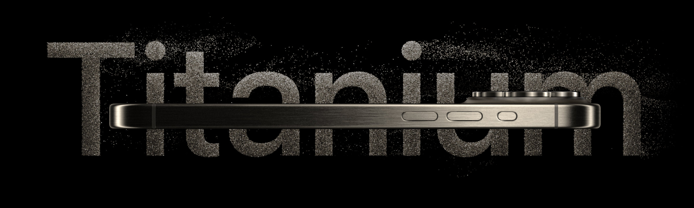
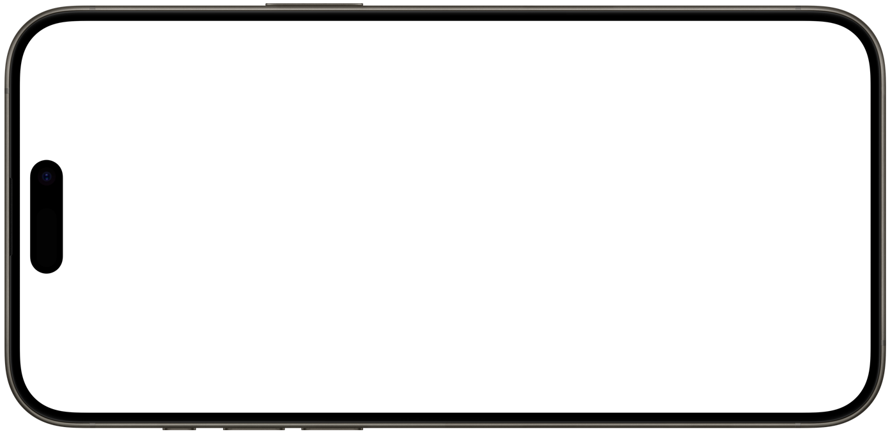

<div align="center">

<picture>
  <source media="(prefers-color-scheme: dark)" srcset="public/assets/images/hero.jpeg" />
  <source media="(prefers-color-scheme: light)" srcset="public/assets/images/hero.jpeg" />
  
</picture>

<h1>
  
  iPhone 15 Pro Experience
</h1>

<h3 align="center">
    A breathtaking 3D showcase powered by cutting-edge web technologies
</h3>

<p align="center">
    <a href="https://github.com/GourangaDasSamrat/iphone-15-pro-3d-website-clone/stargazers">
        
    </a>
    <a href="https://github.com/GourangaDasSamrat/iphone-15-pro-3d-website-clone/network/members">
        
    </a>
    <a href="https://choosealicense.com/licenses/mit/">
        
    </a>
</p>

<br/>

<div align="center">
  
  
  
  
</div>

<br/>

<h3>📱 Experience the future of web design with this stunning 3D iPhone showcase</h3>

<br/>

[🎥 Live Demo](#demo) • [✨ Features](#features) • [🛠️ Tech Stack](#tech-stack) • [📊 Performance](#performance) • [🚀 Quick Start](#getting-started)

🚀 A stunning 3D website clone of Apple's iPhone 15 Pro page, featuring immersive animations and interactive 3D models.

[Demo](#demo) · [Features](#features) · [Tech Stack](#tech-stack) · [Performance](#performance) · [Getting Started](#getting-started)

</div>

## ✨ Key Features

<div align="center">
  <table>
    <tr>
      <td align="center">
        <br/>
        🎨 Stunning 3D Model
      </td>
      <td align="center">
        <br/>
        🎥 Smooth Animations
      </td>
      <td align="center">
        <br/>
        📱 Fully Responsive
      </td>
    </tr>
  </table>
</div>

### 🌟 Highlights

- 🎮 Interactive 3D model with intuitive controls
- 🎬 Dynamic video sections with seamless transitions
- ⚡ Optimized for maximum performance
- 🎨 Apple-inspired modern UI/UX design
- 🔥 GSAP powered smooth animations
- 📦 Efficient asset loading and management
- 🛠️ Built with industry best practices

## 🌟 Live Demo

<div align="center">
  <h3>
    <a href="https://iphone-15-pro-3d-website-clone.vercel.app/" target="_blank">
      
    </a>
  </h3>

  <a href="https://iphone-15-pro-3d-website-clone.vercel.app/" target="_blank">
    
  </a>

  <p>
    <i>✨ Experience the next generation of web development</i><br>
    <a href="https://iphone-15-pro-3d-website-clone.vercel.app/" target="_blank">iphone-15-pro-3d-website-clone.vercel.app</a>
  </p>
</div>

<div align="center">
  <table>
    <tr>
      <td align="center">
        <h4>🎥 Demo Highlights</h4>
        • Interactive 3D Model<br>
        • Stunning Animations<br>
        • Responsive Design
      </td>
      <td align="center">
        <h4>🎮 Controls</h4>
        • Drag to Rotate<br>
        • Pinch to Zoom<br>
        • Double-tap to Reset
      </td>
    </tr>
  </table>
</div>

## 💫 Technology Ecosystem

<div align="center">
  <table>
    <tr>
      <th>🎨 Frontend & Design</th>
      <th>⚙️ Development</th>
      <th>📦 Libraries</th>
    </tr>
    <tr>
      <td>
        <br/>
        <br/>
        
      </td>
      <td>
        <br/>
        <br/>
        
      </td>
      <td>
        <br/>
        <br/>
        
      </td>
    </tr>
  </table>
</div>                                                                                                                             |

</div>

## 🏗️ Project Architecture

<div align="center">
  
</div>

<table align="center">
<tr>
  <td>
    <details>
      <summary><b>📁 Project Structure</b></summary>

```bash
📦 ROOT
├── 🌐 public/              # Static Assets
│   ├── 🎨 assets/         # Media Resources
│   │   ├── 🖼️ images/    # Image Assets
│   │   └── 🎥 videos/    # Video Content
│   └── 📱 models/         # 3D Models
├── 🛠️ src/                # Source Code
│   ├── 🧩 components/     # React Components
│   │   ├── Hero.jsx      # Hero Section
│   │   ├── Features.jsx  # Features Display
│   │   └── ...          # Other Components
│   ├── ⚙️ constants/     # Configuration
│   └── 🔧 utils/         # Utilities
└── 📄 Configuration Files
```

</details>
  </td>
</tr>
</table>

### 📚 Key Directories

<table align="center">
  <tr>
    <td align="center"><b>🎯 Directory</b></td>
    <td align="center"><b>💡 Purpose</b></td>
  </tr>
  <tr>
    <td><code>components/</code></td>
    <td>Modular React components with clean architecture</td>
  </tr>
  <tr>
    <td><code>models/</code></td>
    <td>Optimized 3D models and animations</td>
  </tr>
  <tr>
    <td><code>utils/</code></td>
    <td>Helper functions and custom hooks</td>
  </tr>
</table>

## 📊 Performance & Quality Metrics

<div align="center">
  
</div>

<table align="center">
<tr>
<td>

### 🏆 Lighthouse Scores

<div align="center">


</div>

</td>
</tr>
</table>

### ⚡ Core Web Vitals & Performance Metrics

<div align="center">
  <table>
    <tr>
      <td align="center">
        
        <br/>
        <small>First Contentful Paint</small>
      </td>
      <td align="center">
        
        <br/>
        <small>Largest Contentful Paint</small>
      </td>
    </tr>
    <tr>
      <td align="center">
        
        <br/>
        <small>Total Blocking Time</small>
      </td>
      <td align="center">
        
        <br/>
        <small>Cumulative Layout Shift</small>
      </td>
    </tr>
  </table>

  <br/>

  
  
</div>

</div>

## 🚀 Installation Guide

<div align="center">
  <a href="https://stackblitz.com/github/GourangaDasSamrat/iphone-15-pro-3d-website-clone">
    
  </a>
  <a href="https://codesandbox.io/s/github/GourangaDasSamrat/iphone-15-pro-3d-website-clone">
    
  </a>
</div>

<br/>

### 📋 Prerequisites

<table>
<tr>
<td>

```bash
Node.js >= 14.0.0
npm >= 6.0.0
git
```

</td>
<td>

[](https://nodejs.org/)
[](https://www.npmjs.com/)
[](https://git-scm.com/)

</td>
</tr>
</table>

### ⚡ Quick Setup

```bash
# Clone the repository
git clone https://github.com/GourangaDasSamrat/iphone-15-pro-3d-website-clone.git

# Navigate to project directory
cd iphone-15-pro-3d-website-clone

# Install dependencies
npm install

# Start development server
npm run dev
```

### 🔧 Available Scripts

<table>
<tr>
  <td><b>Command</b></td>
  <td><b>Description</b></td>
  <td><b>Environment</b></td>
</tr>
<tr>
  <td><code>npm run dev</code></td>
  <td>Start the development server</td>
  <td><code>development</code></td>
</tr>
<tr>
  <td><code>npm run build</code></td>
  <td>Build for production</td>
  <td><code>production</code></td>
</tr>
<tr>
  <td><code>npm run preview</code></td>
  <td>Preview production build</td>
  <td><code>production</code></td>
</tr>
<tr>
  <td><code>npm run lint</code></td>
  <td>Lint and fix files</td>
  <td><code>development</code></td>
</tr>
</table>

### 📦 Development Environment

The development server will start at `http://localhost:5173` by default. The application will automatically reload if you change any of the source files.

### 🛠️ Development Commands

<table>
  <tr>
    <td><code>npm run dev</code></td>
    <td>Start development server</td>
  </tr>
  <tr>
    <td><code>npm run build</code></td>
    <td>Build for production</td>
  </tr>
  <tr>
    <td><code>npm run preview</code></td>
    <td>Preview production build</td>
  </tr>
</table>

## 👤 Author & Contact

<p align="center">
  
</p>

<p align="center">
  <b>Gouranga Das Samrat</b><br>
  <i>Frontend Developer | JavaScript & React Expert | Open Source Enthusiast</i>
</p>

<p align="center">
  <a href="https://github.com/GourangaDasSamrat" title="GitHub"></a>
  <a href="https://linkedin.com/in/gouranga-das-samrat" title="LinkedIn"></a>
  <a href="https://gouranga-das.netlify.app/" title="Portfolio"></a>
  <a href="mailto:gouranga.das.khulna@gmail.com" title="Email"></a>
  <a href="https://leetcode.com/u/gourangadassamrat/" title="LeetCode"></a>
  <a href="https://codepen.io/gouranga-das-samrat" title="CodePen"></a>
  <a href="https://www.reddit.com/user/Capable-Plantain8709/" title="Reddit"></a>
  <a href="https://www.behance.net/gourangsamrat" title="Behance"></a>
  <a href="https://dribbble.com/gourangadassamrat" title="Dribbble"></a>
  <a href="https://stackoverflow.com/users/27733996/gouranga-das-samrat?tab=profile" title="Stack Overflow"></a>
  <a href="https://www.quora.com/profile/Gouranga-Das-Samrat" title="Quora"></a>
  <a href="https://www.twitch.tv/gourangadassamrat" title="Twitch"></a>
  <a href="https://www.youtube.com/@GourangaDasSamrat" title="YouTube"></a>
  <a href="https://medium.com/@gouranga.das.khulna" title="Medium"></a>
  <a href="https://gourangadassamrat.blogspot.com/" title="Blogger"></a>
  <a href="https://discord.gg/jnZStfKW7v" title="Discord"></a>
  <a href="https://x.com/gouranga_khulna" title="X"></a>
  <a href="https://www.facebook.com/gourangadassamrat" title="Facebook"></a>
  <a href="https://instagram.com/gouranga.das.khulna" title="Instagram"></a>
  <a href="https://www.tiktok.com/@gourangadassamrat" title="TikTok"></a>
  <a href="https://www.threads.net/@gouranga.das.khulna" title="Threads"></a>
  <a href="https://pinterest.com/gourangadaskhulna" title="Pinterest"></a>
</p>

<p align="center">
  <i>Let's connect! I'm always open to collaboration, frontend projects, or just a friendly chat about JavaScript and React.</i>
</p>
